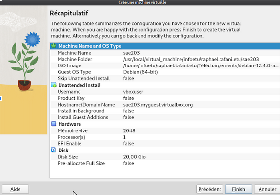
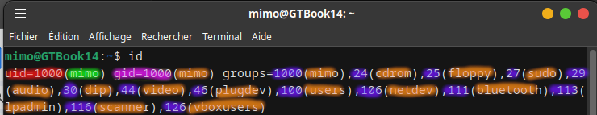

# Rapport SAÉ 2.03

Hadrien M, Raphaël T et Kellian S (Groupe F, BUT1 Info Semestre 2)

## Caractéristiques de la VM utilisée

## Réponses aux questions
1. 
    * 64 bits correspond à l'architecture du processeur de la machine. Il existe plusieurs types d’architectures, comme le 32 bits pour les ordinateurs, ou encore le ARM (32 ou 64 bits, utilisé notamment dans les smartphones et certains ordinateurs portables, ce type de processeur a pour avantage de consommer et chauffer peu). Quand on télécharge une image de système d’exploitation, il faut donc qu’elle corresponde au processeur. Dans le cas des ordinateurs, souvent on peut quand même installer un système 32 bits sur un ordinateur 64 bits, mais on ne pourra pas bénéficier des avantages du 64 bits (en 32 bits on peut traiter moins de données, et on est limités à un peu moins de 4Go de RAM)

    * Par défaut, Virtualbox utilise une carte réseau virtuelle de type NAT, ou translation d’adresse, ça “traduit” l’adresse IP de la machine hôte à celle de la machine virtuelle. [source](https://www.it-connect.fr/comprendre-les-differents-types-de-reseaux-virtualbox/ )

    * Ce fichier est `usr/local/virtual_machine/infoetu/login/sae203/sae203.vbox-prev`. Il ne contient pas de champs relatifs au processeur de la VM, par ailleurs il n'est pas recommandé de l'éditer directement.

2.
    * Un fichier `iso` **bootable** est un disque dématérialisé (de type CD, DVD, etc) qui permet de démarrer une machine, notamment pour installer un système d'exploitation, ou encore essayer un OS avant de l'installer (images iso de type *live CD*). [source](https://www.winzip.com/fr/learn/file-formats/iso/)

    * MATE: Environnement de bureau qui utilise *GNOME* comme base. Il est créé pour les systèmes UNIX. [source](https://mate-desktop.org/fr/)

    * GNOME: Acronyme de *GNU Network Object Model Environment*, est un environnement de bureau libre dont l'objectif est de rencdre accessible l'utilisation d'un système d'exploitation GNU Linux à un plus grand nombre. [source](https://doc.ubuntu-fr.org/gnome)

    * Un *serveur web* est un serveur qui répond à des requêtes WWW sur un réseau. Les serveurs Web hébergent les *sites web* et leur ensemble constitue le World Wide Web. [source](https://fr.wikipedia.org/wiki/Serveur_web)

    * *SecureShell* (`ssh`) est un programme informatique et un protocole de communication, sécurisé par des clés. Il permet, par exemple, de se connecter à distance à une machine Linux, préalablement munie d'un programme nommé *serveur SSH*, à partir d'une machine cliente et d'un programme de *client SSH*, avec les identifiants et mots de passe adéquats, et d'entrer des commandes à la machine serveur, comme on le ferait en personne, face à la machine serveur, à travers la console ou un terminal d'invites de commandes. [source](https://fr.wikipedia.org/wiki/Secure_Shell)

    * Un serveur mandataire, plus communément appelé *proxy*, est un serveur informatique qui a pour fonction de relayer des requêtes entre un poste client et un serveur. [source](https://www.varonis.com/fr/blog/serveur-proxy)

3.

	* On peut utiliser la commande `id` tout en étant connecté sous l’utilisateur dont on souhaite savoir dans quel groupe il est. Cette commande renvoie plusieurs informations: le nom d’utilisateur, son UID (*User ID*), son GID (*Group ID*) ainsi que les GID et noms des groupes où il est. (Source: le manuel intégré à Linux Debian (commande `man id`))

	* 

	* Figure: capture d’écran du résultat de la commande `id`, ici réalisée sur mon ordinateur personnel. En rouge, l’UID de mon compte utilisateur, en vert le nom de mon utilisateur (ici *mimo*), et en rose le GID qui correspond au groupe de mon utilisateur. En bleu le GID et en orange le nom des groupes dont je fais partie.

4.
	* Grâce à la commande `uname -r` nous avons remarqué que la version du noyau Linux de nos installations est la *6.1.0-18-amd64*.

	* Les suppléments invités servent à optimiser la machine virtuelle: optimiser ses performances et ajouter des fonctionnalités, comme le partage de fichiers ou du presse papier (commandes *copier* et *coller*) entre la machine hôte et invitée, ou encore l'adaptation automatique de la résolution d'écran e fonction des dimensions de la fenêtre. [source](https://fr.wikipedia.org/wiki/Oracle_VM_VirtualBox)

	* De manière générale, la commande `mount` permet de manipuler le montage des différents ssystèmes de fichiers (partitions, disques...), dans notre cas nous a permis de monter l'image ISO des CD ROM des suppléments invités de notre VM

5. 
	*  Le projet *Debian* est à la base un projet universitaire de Ian Murdok afin que Linux reste libre et accessible. Le nom Debian vient de son propre nom, et de celui de sa femme (Debra) [source](http://www.debianhelp.co.uk)

	* La prise en charge LTS dure 5 ans, ELTS 10 ans quand à la prise en charge minimum est de 3 ans. [Source](https://debian.org/releases/index.fr.html)

	* [source](https://wiki.debian.org/LTS) Les versions actuellement prises en charge par Debian sont celles de la version 6 à la version 12, respectivement nommées dans l'ordre (*squeeze , wheezy , jessie , stretch , buster , bullseye , bookworm*) Cependant les versions 6 à 9 sont actuellement en fin de vie, la version 10 est prise en charge par la *LTS team* et les 11 et 12 par la *Support and security team*.

	* Les noms de code des différentes versions de Debian proviennent principalement de personnages de *Toy Story* [source](http://www.debianhelp.co.uk/)

	* Il y a actuellement 9 architectures prises en charge par Debian Bullseye qui sont :

	| Nom architecture | Description |
	|---------|----------|
	| amd64 | Processeurs 64 bits PC, présents sur la plupart des ordinateurs actuels |
	| i386 | Processeurs 32 bits PC, présent sur des ordinateurs datant d'avant les années 2010 |
	| ppc64el | Plateforme "IBM Power", processeurs PowerPC qui ont notamment équipé d'anciens Mac, ou encore des consoles de jeu comme la Nintendo Gamecube, Wii et WiiU, et la XBOX360 |
	| s390x | Plateforme 32 bits d'IBM, des années 90, a principalement été utilisée dans des serveurs d'entreprise |
	| armel |  ancienne architecture de processeurs ARM 32 bits, qui était utilsée dans des NAS, ou encore certains mini PC |
	| armhf | Architecture ARM 32 bits avec un "hard float" (point flottant matériel), qui a été utilisée sur d'anciens smartphones entre autres, aussi sur des consoles de jeu portables comme la Nintendo DS et Nintendo 3DS |
	| arm64 | Architecture ARM 64 Bits, utilisée sur la majorité des smartphones, tablettes, et plus récemment certains ordinateurs portables |
	| mipsel | Architecture MIPS 32 BITS Little Endian, utilisé sur certains MicroPC et cartes de développement |
	| mips64el | Même que ci dessus en 64 bits, a notamment été utilisée sur des consoles de jeu comme la Playstation 1 et 2, ou encore la Nintendo 64, et certains matériels réseaux (routeurs Cisco) |

	[source](https://wiki.debian.org/fr/DebianBullseye#Architectures)

	* le nom de code de la première version est “Buzz”, elle a été annoncée le 17 juin 1996,le nom de distribution était : Debian GNU/Linux 1.1. [Source](https://wiki.debian.org/fr/DebianBuzz)

	* Le nom de code de la dernière version à ce jour est *Bookworm*. Sur la page de ce dernier on nous dit quand il a été publié (Le 10 juin 2024) mais pas lorsqu'il fut annoncé. La version actuelle est la 12.5.

6. 
	* Gitea est une Forge logicielle (éditeur de texte conçu pour le développement d’applications) basée sur Git et sortie en 2016 sous licence MIT. [source](https://fr.wikipedia.org/wiki/GiteaGitea)

	* Nous pouvons le comparer à GitLab car ils ont la même base (Git), même si l’un sert plus a de la logistique tel qu’un suivi de bug, une livraison et une intégration continue(GitLab) et l’autre à de l’hébergement de code source (Gitea)mais nous pouvons également le comparer à GitHub, qui est également sous la base Git et qui sert également à héberger des codes sources, mais celui ci se passe sur un site web. [source](https://fr.wikipedia.org/wiki/Git)

7. 
	* Gitk est un navigateur de dépôt graphique, il se lance grâce à la commande gitk [source] (https://www.atlassian.com/fr/git/tutorials/gitk)

	* Git gui permet de modifier ces répertoires en faisant de nouveau commits et autre [source](https://git-scm.com/docs/git-gui) , pour le lancer il suffit de taper la commande git citool [source](https://askubuntu.com/questions/432163/how-to-start-git-gui)

8. 
	* Grâce à la commande: wget -O gitea https://dl.gitea.com/gitea/1.21.7/gitea-1.21.7-linux-amd64 chmod +x gitea [source](https://docs.gitea.com/next/installation/install-from-binary)
	![commande] (cmd_id.png)

	Nous pouvons installer la bonne dernière version de Gitea pour notre machine virtuelle (il y en a plusieurs en fonction du type de machine utiliser) puis directement après, si la bonne version est installée, nous pouvons le rendre exécutable.

	* Nous pouvons mettre à jour Gitea en le stoppant, remplacer le code binaire dans /usr/local/bin/gitea puis en relançant l’instance, il y a deux méthode pour la relancer, l’une avec systemd qui est recommander ou il suffit juste d’entrer la commande(systemctl restart gitea), et sans systemd, nous pouvons utiliser la commande (killall -1 gitea) qui relance l’instance grace a SIGHUP [source](https://docs.gitea.com/next/installation/install-from-binary)

## Travaux effectués

### Semaine du 12/02/2024

* Raphaël: Recréation de la machine pour l’utiliser en tant que root - Échec, il me laisse pas configurer les logins.

* Hadrien: Réinstallation de la VM en utilisant les fichiers de préconfiguration, sur mon ordinateur personnel 
  * modification du script `preseed.cfg` afin d’avoir le bon chemin vers mon disque Debian.iso
	* en suivant les consignes d’ajustement de la préconfiguration

* Kellian: réinstallation de la VM avec l’aide d’Hadrien pour avoir les bons paramètres de configuration

### Semaine du 19/02/2024

* Rédaction de ce fichier en format Markdown, pour le premier rendu

### Semaine du 11/03/2024
* Premier retour avec commentaires sur le fichier de rendu Markdown
* En prenant en compte les commentaires du professeur, rectifications sur le rapport:
	* Ajout de références aux réponses des questions de la SAÉ
	* Redimensionnement des images
	* Corrections diverses dans la mise en page de l'ensemble
	* Rectification du Readme et rendu plus lisible ce dernier
	* Sous-listes ajoutées (comme ici)

### Semaine du 18/03/2024
* Finalisation de la version finale du rapport:
	* Ajout d'une table des matières automatique
	* Correction de la commande pandoc spécifiée dans le README
* Rendu final effectué